# GOMMEMODE
Silently switches to the strongest weapon in your inventory when dealing damage.

This way, opponents take damage from your strongest weapon (like a sword) while you keep the effects of the original item you’re holding (such as knockback from a stick).

It automates weapon switching to maximize damage and utility without manual input.

```mermaid
flowchart LR
    GM[GommeMode Enabled 🗡️] --> SW[Silently switches to strongest weapon ✅]
    GM --> KE[Keeps effects of current item 🌀]
    GM --> RISK[⚠️ Risky on strict anti-cheats]
    RISK --> FLAG[Can flag due to desync or fake hits ❌]

    style GM fill:#e3f2fd,stroke:#2196f3,stroke-width:2px,color:#000
    style SW fill:#e8f5e9,stroke:#43a047,stroke-width:2px,color:#000
    style KE fill:#fff8e1,stroke:#fbc02d,stroke-width:2px,color:#000
    style RISK fill:#ffebee,stroke:#e53935,stroke-width:2px,color:#000
    style FLAG fill:#f3e5f5,stroke:#8e24aa,stroke-width:2px,color:#000
```

